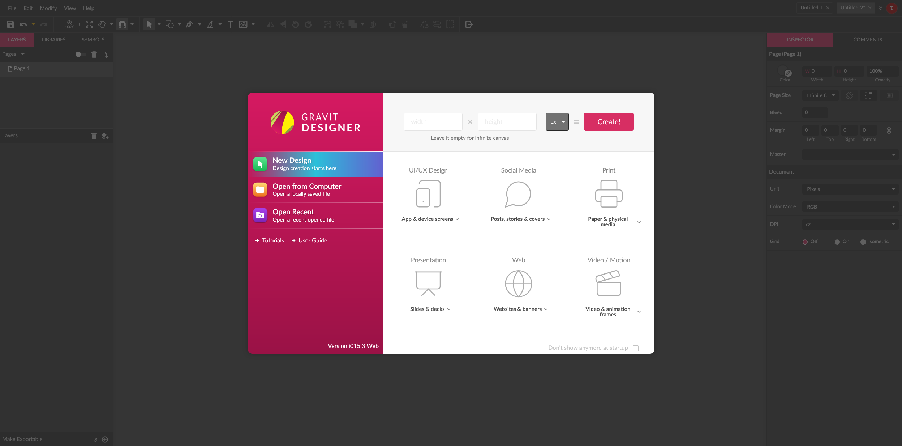

# Gravit Designer — Self-Hosted Edition

<p align="center">
  
</p>

<p align="center">
  A locally hosted version of <strong>Gravit Designer</strong> (Corel Vector) with a reverse-engineered module system, offline capability, and full Pro features — no cloud account required.
</p>

---

## Screenshots

<table>
  <tr>
    <td align="center"><strong>Welcome Screen</strong></td>
    <td align="center"><strong>New Document</strong></td>
  </tr>
  <tr>
    <td></td>
    <td></td>
  </tr>
</table>

## Features

- **Fully offline** — runs on `localhost` with zero external dependencies at runtime
- **Native desktop apps** — pre-built Electron binaries for Windows and Linux (macOS buildable on Mac)
- **Pro license unlocked** — all premium features available out of the box
- **Express server** with static file serving, WebSocket support, and API stubs
- **Multi-language support** — 15 locales including EN, DE, FR, ES, JA, ZH, and more
- **Built-in documentation** — complete HTML user guide served at `/docs`
- **Reverse-engineering toolkit** — tools to extract, analyze, and reconstruct the minified source

## Desktop App (Releases)

Pre-built native Electron apps are available in the `releases/` directory:

| Platform    | File                                           | Type                  |
| ----------- | ---------------------------------------------- | --------------------- |
| **Windows** | `Gravit Designer Setup 1.0.0.exe`              | NSIS Installer        |
| **Windows** | `Gravit Designer 1.0.0.exe`                    | Portable (no install) |
| **Linux**   | `gravit-designer-local-1.0.0-linux-x64.tar.gz` | Standalone archive    |

> **macOS**: Must be built on a Mac — see [Building Desktop Apps](#building-desktop-apps) below.

### Running the Desktop App

- **Windows Installer** — double-click `Gravit Designer Setup 1.0.0.exe` and follow the wizard
- **Windows Portable** — run `Gravit Designer 1.0.0.exe` directly, no installation needed
- **Linux** — extract the tar.gz, then run the `gravit-designer-local` binary:
  ```bash
  tar xzf gravit-designer-local-1.0.0-linux-x64.tar.gz
  cd gravit-designer-local-1.0.0-linux-x64
  ./gravit-designer-local
  ```

## Quick Start (Server Mode)

### Prerequisites

- **Node.js** ≥ 18.0.0
- **npm**

### Installation

```bash
git clone <repo-url> gravit-designer
cd gravit-designer
npm install
```

### Running

```bash
# Production
npm start

# Development (auto-restart on changes)
npm run dev
```

Open **http://localhost:3100** in your browser.

## Project Structure

```
gravit-designer/
├── server.js                  # Express + WebSocket server
├── package.json
├── manifest.json              # PWA manifest
│
├── public/                    # Client-side application
│   ├── index.html             # Entry point
│   ├── designer.browser.js    # Main app bundle (~6.7 MB)
│   ├── designer.browser.dev.js # Dev build (generated)
│   ├── chunk.vendor.js        # Core engine (~11.7 MB)
│   ├── assets/
│   │   ├── font/              # Bundled fonts
│   │   ├── icon/              # UI icons
│   │   ├── img/               # Images & branding
│   │   └── prerendered/       # App icons (16–512 px)
│   └── *.worker.js            # Web Workers (PDF, PS, autosave)
│
├── routes/
│   ├── user.js                # User profile & settings API
│   └── ws.js                  # WebSocket (license heartbeat)
│
├── docs/                      # Full HTML user guide (~90 pages)
│   └── images/                # Guide screenshots & illustrations
│
├── scripts/
│   └── generate-icons.cjs     # SVG icon generator
│
├── electron-main.js           # Electron main process
│
├── releases/                  # Pre-built desktop apps
│   ├── Gravit Designer Setup 1.0.0.exe   # Windows installer
│   ├── Gravit Designer 1.0.0.exe         # Windows portable
│   └── *-linux-x64.tar.gz               # Linux archive
│
└── reverse-engineering/       # Source analysis toolkit
    ├── build-bundle.cjs       # Rebuilds dev bundle
    ├── extract-all-modules.cjs
    ├── analyze-refs.cjs
    ├── rename-variables.cjs
    ├── extracted-modules/     # Webpack module maps
    ├── reconstructed/         # Reconstructed source files
    ├── analysis/              # Class & reference reports
    └── README.md              # Toolkit documentation
```

## NPM Scripts

| Script               | Description                                            |
| -------------------- | ------------------------------------------------------ |
| `npm start`          | Start the server on port 3100                          |
| `npm run dev`        | Start with `--watch` for auto-reload                   |
| `npm run build`      | Rebuild the dev bundle from reverse-engineered modules |
| `npm run icons`      | Generate SVG icon set                                  |
| `npm run serve`      | Build + start in one command                           |
| `npm run clean`      | Remove the generated dev bundle                        |
| `npm run electron`   | Launch as Electron desktop app (dev)                   |
| `npm run dist:win`   | Build Windows installer + portable `.exe`              |
| `npm run dist:linux` | Build Linux `.tar.gz` archive                          |
| `npm run dist:mac`   | Build macOS `.dmg` (requires macOS host)               |
| `npm run dist:all`   | Build for all platforms at once                        |

## Server API

The Express server exposes lightweight stubs so the client runs entirely offline:

| Endpoint                              | Method | Purpose                                     |
| ------------------------------------- | ------ | ------------------------------------------- |
| `/connection/test`                    | GET    | Connectivity check → `"OK"`                 |
| `/maintenance/status`                 | GET    | Maintenance flag → `{ maintenance: false }` |
| `/license`                            | GET    | License info → Pro plan, no expiry          |
| `/subscription/test`                  | GET    | Subscription status → active Pro            |
| `/user/profile`                       | GET    | Local user profile                          |
| `/file`                               | GET    | File listing (empty)                        |
| `/i18n-url/:locale/designer`          | GET    | i18n resource URL                           |
| `ws://localhost:3100/license/license` | WS     | License heartbeat (ping/pong)               |

## Documentation

The bundled user guide is served at **http://localhost:3100/docs** and covers:

<table>
  <tr>
    <td>

- Getting Started & Quickstart
- Drawing & Shape Tools
- Vector Anatomy & Paths
- Colors, Gradients & Textures
- Fills, Borders & Effects
- Text Properties & Text on Path

</td>
    <td>

- Layers, Groups & Symbols
- Alignment, Distribution & Grids
- Import, Export & File Formats
- Blending Modes & Clipping Masks
- Keyboard Shortcuts
- Touch Interface Guide

</td>
  </tr>
</table>

<p align="center">
  
</p>

## Reverse Engineering

The `reverse-engineering/` directory contains a full toolkit for analyzing and modifying the Gravit Designer source code. Key discoveries:

- **All class names preserved** — `GObject`, `GScene`, `GEditor`, `GPaintCanvas`, etc.
- **All method names preserved** — `getBBox`, `transform`, `paint`, `hitTest`, etc.
- **Inheritance tree intact** — via `GObject.inherit()` pattern

```bash
cd reverse-engineering
npm install
node build-bundle.cjs        # Rebuild the dev bundle
node extract-all-modules.cjs # Extract webpack module map
node analyze-refs.cjs         # Cross-reference analysis
node rename-variables.cjs     # Improve minified variable names
```

See [reverse-engineering/README.md](reverse-engineering/README.md) for the full toolkit documentation.

## Tech Stack

| Component | Technology                        |
| --------- | --------------------------------- |
| Runtime   | Electron 33                       |
| Server    | Node.js + Express 5               |
| WebSocket | ws 8.x                            |
| Client    | Gravit Designer (Webpack bundle)  |
| Workers   | PDF export, PostScript, Autosave  |
| Styles    | Light & Dark themes (CSS)         |
| PWA       | Web App Manifest + Service Worker |

## Theming

Gravit Designer ships with two themes out of the box:

| Theme | Stylesheet                   |
| ----- | ---------------------------- |
| Light | `designer.browser.light.css` |
| Dark  | `designer.browser.dark.css`  |

<table>
  <tr>
    <td align="center"><strong>Light Theme</strong></td>
    <td align="center"><strong>Dark Theme</strong></td>
  </tr>
  <tr>
    <td></td>
    <td></td>
  </tr>
</table>

## Configuration

| Variable | Default | Description                                |
| -------- | ------- | ------------------------------------------ |
| `PORT`   | `3100`  | Server port (set via environment variable) |

```bash
# Run on a custom port
PORT=8080 npm start
```

## Building Desktop Apps

To rebuild the Electron apps from source:

```bash
npm install

# Windows (NSIS installer + portable)
npm run dist:win

# Linux (tar.gz archive)
npm run dist:linux

# macOS (requires building on a Mac)
npm run dist:mac

# All platforms (run on macOS for full coverage)
npm run dist:all
```

Output goes to the `releases/` directory. Cross-compilation notes:

| Host OS | Can build for         |
| ------- | --------------------- |
| Windows | Windows, Linux        |
| macOS   | Windows, macOS, Linux |
| Linux   | Windows, Linux        |

> **macOS builds require a macOS host** — this is an Electron/code-signing limitation. Use a Mac or a CI service like GitHub Actions for macOS builds.

## License

This project is intended for **educational and personal use only**. Gravit Designer / Corel Vector is proprietary software owned by Alludo (formerly Corel Corporation). All rights to the original application remain with their respective owners.
